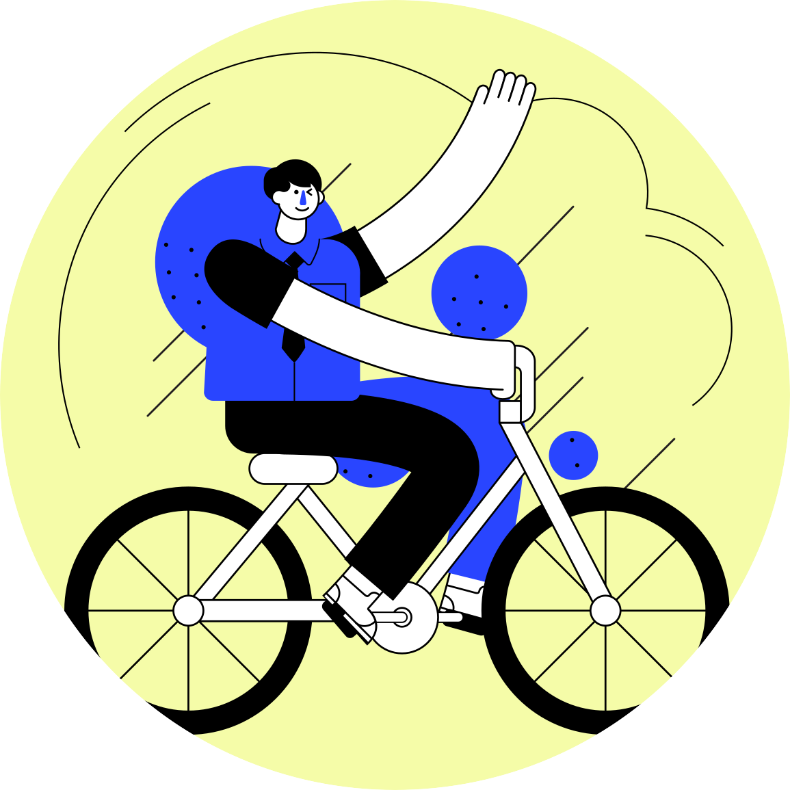

<h2> Hi 👋, I'm Martín García Blanco 👨‍💻</h2>

<h3 align="right">A passionate full stack developer from Galicia, but currently living in Barcelona</h3>
<p><em>FullStack developer at <a href="http://www.interficie.com">InterficieIS</a></</p>

[](https://www.linkedin.com/in/martin-garcia-blanco/)
[](https://github.com/martin-garcia-blanco)

### A little more about me...

```javascript
const martin = {
  code: [Javascript, Typescript, HTML, CSS, Java],
  tools: [React, ReactNative, Redux, Node, Jest, Testing Library, Docker],
  currentMotivations: {
    area: "Mobile developmet",
    tools: [GraphQL, ReactNative],
  },
  sideProject:
    "I am doing a mobile application with ReactNative to find, rate,
    and collect movies and tv shows, at the end of summer we will have the first release",
};
```

<div >
 <em>🤘🏼<b>I love connecting with different people</b> so if you want to say <b>hi, I'll be happy to meet you more!</b> 🤘🏼</em>
</div>
